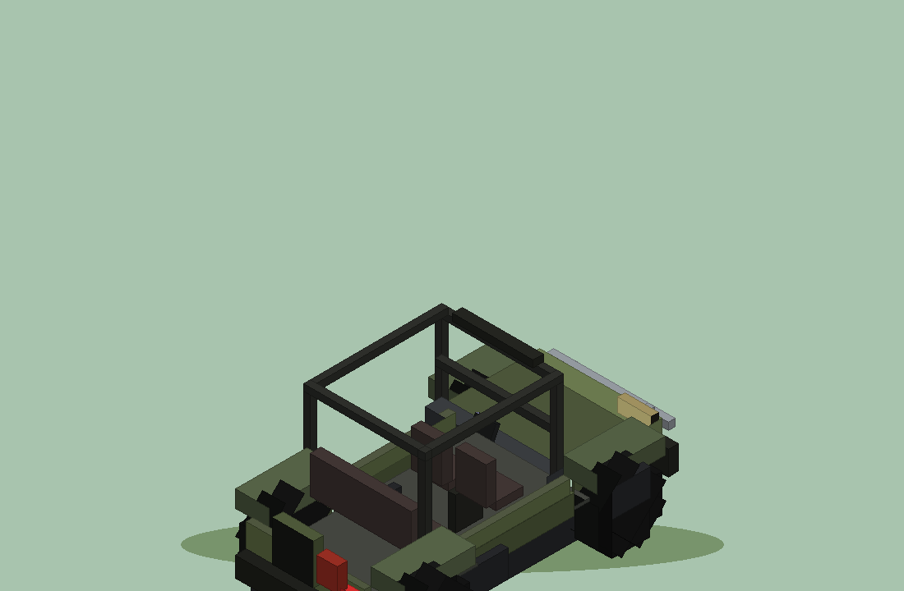

# Offroader — vehicle cu 4x4, 100% vanilla (Java Edition 26.3)

Recreerea offroader-ului din **MrCrayfish's Vehicle Mod**, fără niciun mod: doar un
**datapack** (logica) + un **resource pack** (model 3D, iteme, sunete). Modelul,
texturile și sunetele sunt **originale, generate procedural** (Python), în stilul
mașinii din mod — nu s-au extras/copiat asset-uri din jar-ul modului.



## Ce știe să facă

| Funcționalitate | Cum |
|---|---|
| Conducere WASD | cal invizibil (ajustat ca accelerare/viteză/salt) + modelul plutind deasupra |
| Volan & accelerare | roțile față se orientează după direcție, spinul roților după viteză |
| Turație motor | sunetul de motor se repeta cu pitch în funcție de viteza reală |
| Demaraj/oprire | sunet de pornire la urcarea la volan, de oprire la coborâre |
| Combustibil | 100 unități; consumă doar în mișcare; HUD cu km/h și rezervă |
| Reumplere | bidonul roșu (click-dreapta) reface combustibilul cu 40 + sunet de gâlgâit |
| Boost | 3 secunde de viteză sporită cu sunet dedicat |
| Claxon | click-dreapta cu cheia, din mers sau ca pasager |
| 4 locuri | 1 șofer + 3 pasageri, fiecare cu hitbox de click propriu |
| Depozitare | cheia se folosește lângă mașină pentru a o strânge în inventar |

## Instalare (server NEMODDAT, Java 26.3)

1. Copiază `OffroaderDatapack.zip` în `world/datapacks/` pe server, apoi `/reload`
   (sau repornește serverul).
2. Fiecare jucător instalează **client-side** `OffroaderResourcePack.zip`
   (Setări → Pachete de resurse → Deschide dosarul → adaugă ZIP-ul).
   Fără el mașina e invizibilă (se vede doar calul-fantomă)!
3. În joc: `/function offroader:give` — primești **cheia** (cheie aurie),
   **volanul** și **bidonul**.

### Cerințe tehnice
- Minecraft Java **26.3** (datapack format 121, resource pack format 97).
- `enable-command-block` nu e necesar; nimic nu trebuie activat suplimentar.
- Pack-urile merg pe single-player la fel (pune ambele ZIP-uri).

## Utilizare

- **Cheia, click-dreapta**: dacă nu ești în mașină →vehicleul se cheamă la 1,6
  blocuri în fața ta (dacă nu e deja unul în 5 blocuri — atunci îl strângi și primești
   înapoi obiectele). Dacă ești la volan → claxon. Dacă ești pasager → claxon.
- **Urcarea**: click-dreapta pe **scaunul din față** (cel cu volanul) ca să șofezi,
  sau pe bancheta din spate / scaunul din față-dreapta ca pasager.
- **Mersul**: W/A/S/D ca la cal; spațiu = săritură mică (teren accidentat);
  coborâre cu Shift (sneak).
- **Volanul (item)**: ține-l în mână și click-dreapta pentru **boost** (3 s),
  cooldown 30 s — se aude și se simte.
- **Bidonul**: click-dreapta cu el în mână lângă mașină → +40 combustibil.
- **Coborârea și lăsarea mașinii**: rămâne parcată (nu se mișcă din lovituri);
  strânge-o cu cheia ca să nu o pierzi.

## Regenerare & dezvoltare

Toate asset-urile sunt generate de scripturi Python (folderul `scripts/`):

```
python3 scripts/build_packs.py --regen   # re-generează tot + validează + ZIP
python3 scripts/render_preview.py        # previzualizare PNG a modelului
```

- `config.py` — geometria mașinii, pozițiile roților/scaunelor, atlas texturi.
- `gen_textures.py` — texturile (atlas body 256×256, roți 64×64, iteme 16×16).
- `gen_model.py` — modelele JSON (body 52 elemente, wheel 4, iteme 3×3).
- `gen_quats.py` — tabelele de quaternioni pentru rotiri (yaw 5°, spin 15°).
- `gen_layout.py` — funcțiile de poziționare a pieselor (fl_*, follow, spawn).
- `gen_sounds.py` — sunetele OGG (motor, demaraj, oprire, claxon, boost, gâlgâit).
- `build_packs.py` — validare (referințe, acolade, JSON) + împachetare ZIP.

Pentru ajustări fine (poziția șoferului, înălțimea mașinii), vezi capitolul
„Calibrare” din `offroader/README.md`.

## Limitări cunoscute (v1)

- Rotirea caroseriei se face în trepte de 5° (net perceptibil în mișcare).
- Mașina nu urcă scări de 1 bloc decât cu săritura (spațiu).
- În apă merge încet (calul înoată) — evită râurile adânci.
- Jucătorii foarte departe de mașină nu aud motorul (limită playsound 24 blocuri).
- Două mașini pot ocupa același spațiu (nu există coliziune între vehicule).

## Licență & credit

- Codul acestui proiect: MIT.
- Model, texturi și sunete: generate procedural pentru acest proiect — utilizare liberă.
- MrCrayfish's Vehicle Mod este creația lui MrCrayfish; acest proiect NU conține
  asset-uri din mod — e o creație originală inspirată de designul lui.
